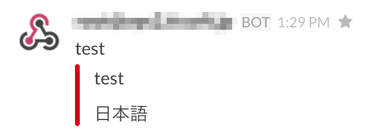

# メールを標準入力で渡して Slack に通知するスクリプト

/etc/aliases とかで受信したメールをこのスクリプトにパイプすると
slack の alerts という channel に通知されます。

## 事前準備

1. slack にサインアップ
2. alerts という channel を作成しておく
3. Integrations で Incoming WebHocks を設定して WebhockURL をメモっておきます。

## 設定

```
$ chmod a+x mail-to-slack.rb
$ vi mail-to-slack.rb
```

WEBHOCKURL に slack の IncommingWebHock の WebhockURL を設定してください。


受信したメールを mail-to-slack.rb にパイプするようにします。
``/etc/aliases``
```
alerts: "|mail-to-slack.rb"
```

## スクリーンショット

こんなかんじで slack に届きます。
username のとこがメール送信者になります。


